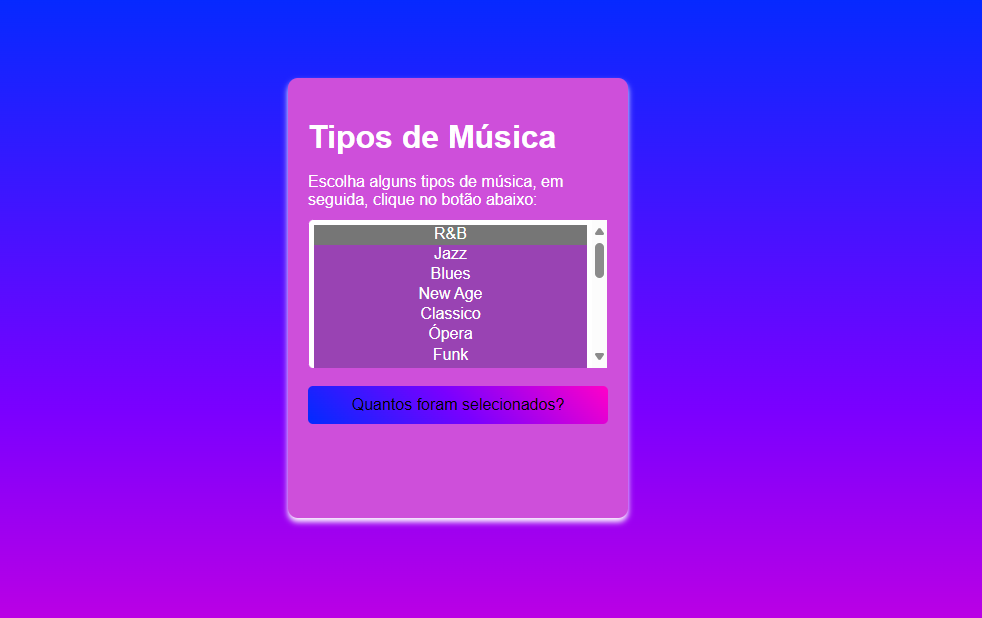

# README: Laço for e Exemplo de Código

# Introdução
Laços for são uma estrutura de controle fundamental em muitas linguagens de programação, incluindo JavaScript, Python, C++, Java e muitas outras. Eles são usados para executar um bloco de código repetidamente com base em uma condição específica. Os laços for são particularmente úteis para iterar sobre uma coleção de elementos, como listas, arrays ou sequências de números.

# Sintaxe do Laço `for`
A sintaxe básica de um laço `for` varia entre diferentes linguagens de programação, mas geralmente segue um formato semelhante:

* Inicialização: Define o valor inicial da variável de controle do loop.

* Condição: Verifica se o loop deve continuar executando. Enquanto a condição for verdadeira, o bloco de código continuará sendo executado.

* Incremento/Decremento: Atualiza o valor da variável de controle do loop após cada iteração.

# Explicação do Código
1. HTML:

* O formulário contém um elemento `<select>` com múltiplas opções (`multiple="multiple"`) permitindo a seleção de vários tipos de música.

* O botão com o ID btn desencadeia a contagem das opções selecionadas quando clicado.

2. JavaScript:

* Função howMany:

* Recebe o objeto do select (selectObject) como argumento.

* Inicializa a variável numeroSelecionadas com 0.

* Utiliza um laço for para iterar sobre todas as opções do select.

* Incrementa numeroSelecionadas para cada opção que estiver selecionada.

* Retorna o número total de opções selecionadas.

* Evento click:

* Adiciona um ouvinte de eventos ao botão.

* Quando o botão é clicado, exibe um alerta com o número total de opções selecionadas, chamando a função how

# Conclusão
Os laços `for` são essenciais para a programação, permitindo a execução repetitiva de blocos de código com base em condições específicas. 
Este exemplo prático demonstra como usar um laço `for` para iterar sobre opções selecionadas em um formulário, tornando-o uma ferramenta poderosa para automatizar tarefas repetitivas e manipular coleções de dados.
# Foto do Site 

# Autor 

* Geovana Lima

